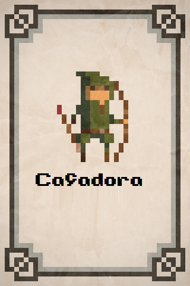
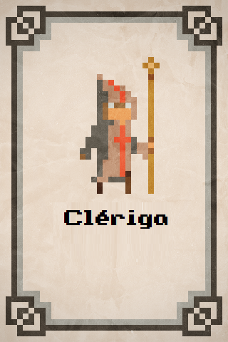

# Oregon-Trial-Game
Oregon Trail game é um jogo que ocorre em um mundo de fantasia, você é um cocheiro iniciante e sua missão é levar aventureiros e itens de um local para outros com a sua carroça nova. 

## Caçador

Um Caçador é um Viajante que se dá melhor encontrando comida, mas também precisa de mais comida. Ele começa com 2 comidas em vez de apenas 1 como os outros viajantes. 

### Método caçadaMelhorada()

Aumente a comida do caçador em 5. (Um viajante convencional ganha apenas 2.)

### Método Comer()

Consome 2 unidades da comida do caçador. Se um caçador não tiver 2 comidas quando for instruído a comer, ele come o quanto puder (0 ou 1 unidade), mas o caçador não fica mais saudável. (Um viajante normal come apenas 1 unidade de comida.)

## Clérigo

Um médico é um viajante que se dá melhor curando outros viajantes, como médico ele deve curar outros viajantes para que eles possam seguir a viagem saudável. 

### Método curar(traveler)

## Listas

- Melhorar carroça: aumenta capacidade, vida, velocidade, defesa. 
- Nível do cocheiro: aumenta vida, influencia, status para combate, status sobrevivência. 
- Missões: pode aumentar influencia e ouro, poderá conceder itens e experiência
- Habilidades dos viajantes: auxiliam ao enfrentar dificuldades(monstros, problemas de percurso, etc...)
- Habilidades do cocheiro: auxiliam ao enfrentar dificuldades(monstros, problemas de percurso, etc...)
- Monstros: Podem ser encontrados durante o caminho e acionar eventos 
- Status: Vida, saúde, ataque, defesa, nível, comida 
- Recursos: Ouro, influencia, itens
- Itens: criar lista de itens durante o desenvolvimento do jogo
- classes: Caçador, clerigo, mago, guerreiro, druida, monje, paladino, mercenário, bruxo, 
- npcs
